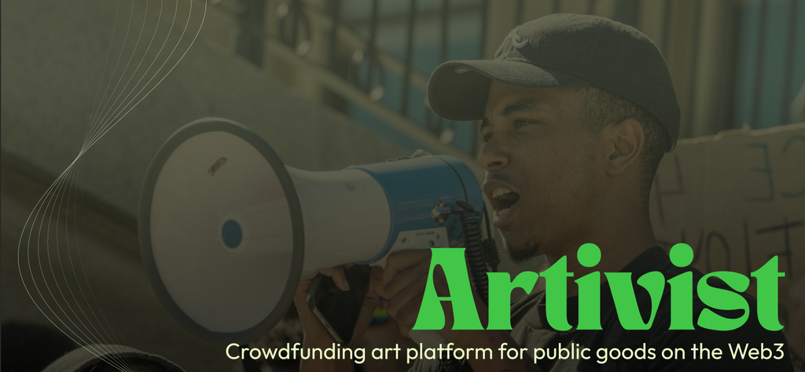
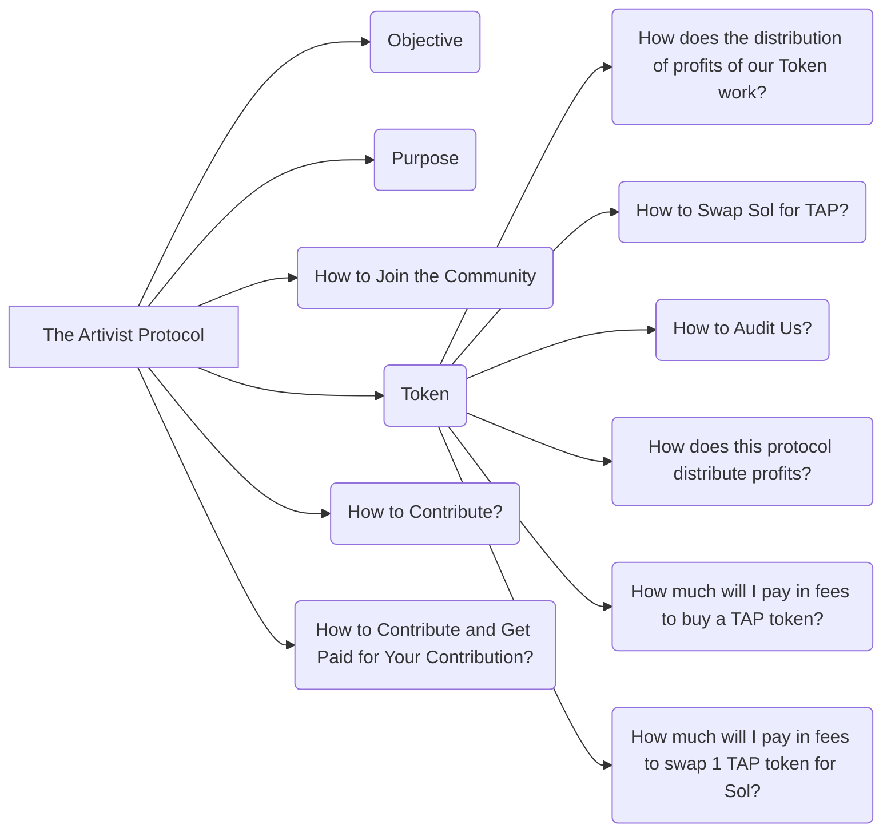
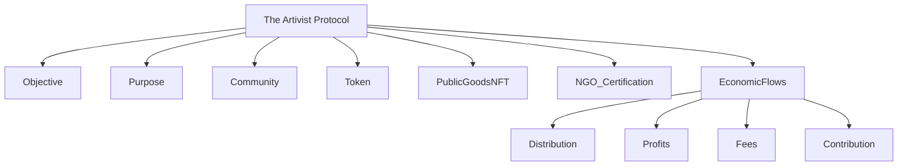

# The_Artivist_Protocol

## Objective

The objective of The Artivist Protocol is to create a decentralized ecosystem that empowers artists and activists, providing a platform where art and activism can merge to promote significant social changes. Our protocol utilizes blockchain technology to ensure transparency and fairness in resource distribution and decision-making.

# The_Artivist_Protocol

[![The Artivist Protocol](https://img.notionusercontent.com/s3/prod-files-secure%2F302425fa-4b5b-46fc-a0c2-ae9b6b2616ff%2F1f4e0684-1611-4982-b4ce-7555a9a80503%2FUntitled.png/size/w=770?exp=1759608747&sig=eiSkfbjUAM8nfc8Fdt0vRS1Jhc2os38Y0PeuYPTG_6U&id=26058cb2-3302-4606-a0f0-67654bc(https://www.notion.so/Artivist-Protocol-DAO-334467c035604aba9fcd43fa8e9ebf0

Build a decentralized ecosystem to empower artists, activists, and social causes. We leverage blockchain to ensure transparency, democratize governance and resource distribution, and connect creative talent and social impact.

## Purpose

Artivist Protocol is a bridge between creativity, activism, and effective philanthropy. Our aim is to provide financial recognition and sustainable support for contributors, building a transparent social impact economy where everyone can participate and be rewarded fairly.

## How to Join the Community

- **Buy “public goods” NFT:** Each NFT represents support for a specific cause or project. By acquiring, you directly fund certified NGOs and social initiatives.
- **Stake NFTs to earn Artvist_Coin:** By staking NFTs, you receive Artvist_Coin, our governance and utility token, unlocking voting rights and special benefits.

## Token

### Artvist_Coin

- **Governance:** Token holders vote on proposals and resource allocation.
- **Rewards:** Access to airdrops and exclusive benefits.
- **Bonus:** Double rewards when buying NFTs using Artvist_Coin.

## "Public Goods" NFTs

- **Definition:** Digital collectibles tied to verifiable causes and real-world impact.
- **Purpose:** Fund development and ongoing work of certified NGOs.
- **Impact:** NFT sales and staking generate traceable donations, transparent allocation, and collective decision-making on fund usage.

## NGO Certification Process

- Each NGO must mint a “ONG Certificated” NFT to be eligible for funding.
- Certification involves:
  - Legal and documental verification
  - Financial audits
  - Assessment of impact and resource management
- Only rigorously reviewed NGOs join, ensuring credibility for all supporters.

## Economic Flows & Governance

## Distribution of Profits

Profits and transaction fees are split proportionally among token holders (Artvist_Coin), project creators, and the DAO treasury. All distributions are on-chain and auditable.

## How to Swap

You can swap Sol for Artvist_Coin using [Raydium](https://raydium.io/), via liquidity pools at current market rates.

## Audit

Our code, contracts, and governance decisions are public and open for anyone to audit. We invite regular reviews and contributions from the community.

## Contribution & Earning

- Propose tasks/projects
- Execute and complete tasks
- Receive Sol or Artvist_Coin as reward
- All contributors are compensated fairly by DAO rules and smart contract logic

***
